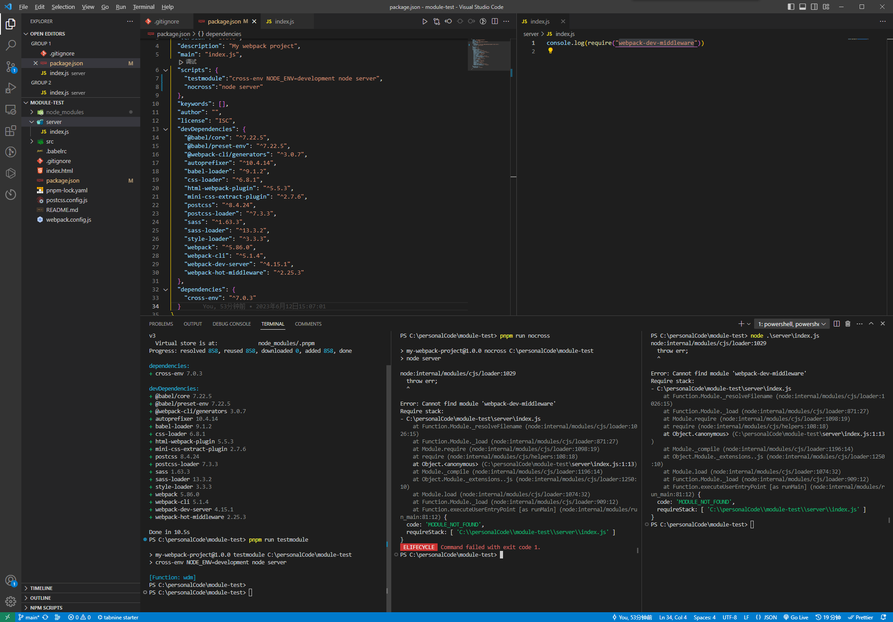
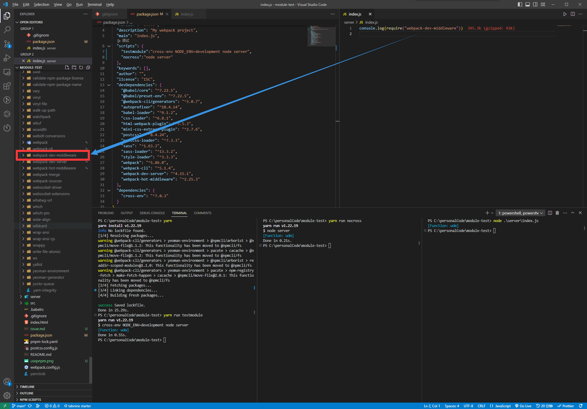

use `cross-env`, can get devDependencies which is not be saved in package.json?

recurrence repository：[JUST-Limbo/module-test (github.com)](https://github.com/JUST-Limbo/module-test)

In the recurrence repository, u can see the `devDependencies` not contains `webpack-dev-middleware` .

I will try to print `require("webpack-dev-middleware")` in `/server/index.js`.

I just run flow commands in the terminal

```shell
pnpm i 
pnpm run test module
pnpm run nocross
node ./server/index.js
```

`webpack-dev-middleware` is not installed in the local `node_modules` folder.

The final result is shown in the following figure.

**Is there anybody can tell me,why `webpack-dev-middleware` can be found in the code when i use `cross-env`?**

**Why the devDependencie  cannot be found when i run `index.js` without `cross-env`?**



If i  use `yarn`,the final result is shown in the following figure.

U can see `webpack-dev-middleware` is already installed in the local `node_modules` folder.

